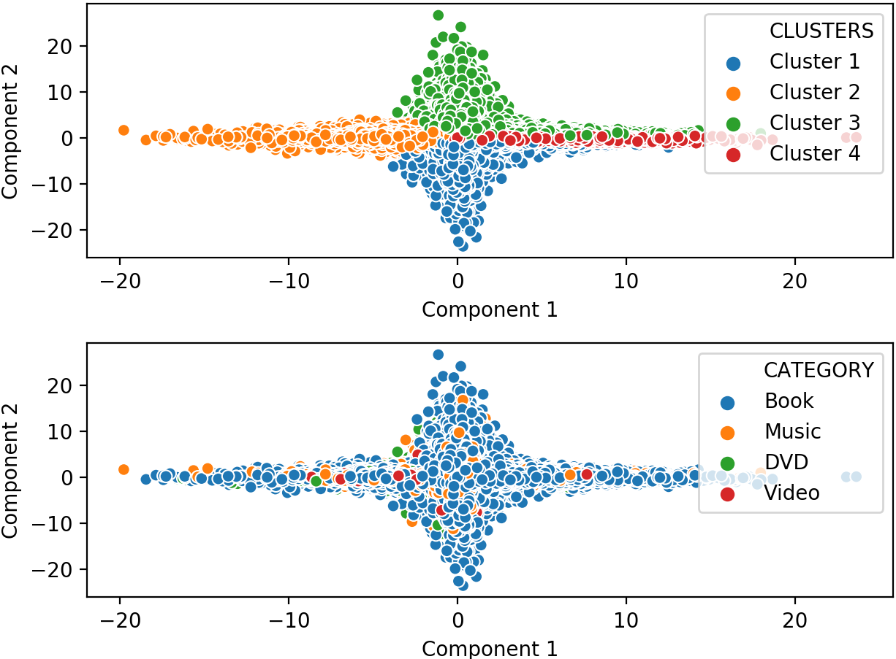
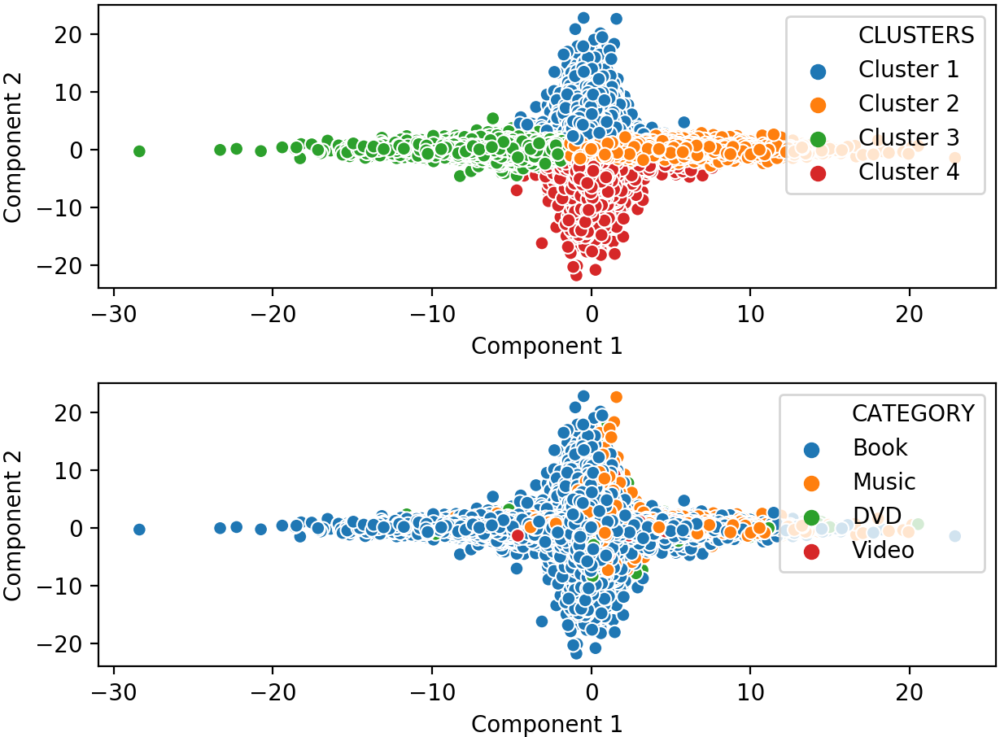

# Exploring Amazon Products: Co-purchase networks and Customer Ratings

## First Reserach Question:
Answer specific research question: Can we recover the product categories by clustering the co-purchase product network?

## Details: 
Plan to use the pure network structure (adjacency matrix) to determine relationships between products. Every product will be a node in the network, and edges are created when product X has co-purchased with product Y (people who buy X also buy Y). We assume that no additional information is available.

### Step 1: DATA ACQUISITION (task is done)
Download raw dataset from the following link and extract: 
https://snap.stanford.edu/data/bigdata/amazon/amazon-meta.txt.gz

### Step 2: PARSING (task is done)
Use the amazon-meta.txt file as input to the Python script extract_network_structure.py. The script will parse the data and using pattern matching will retrieve the following information for each product:
Product ID, Product ASIN, Product Category and
The adjacency list of product X (people who buy X also buy Y, Z, ...)
Then, using the adjacency lists, the product id and asin, it will store the pairs of products that are co-purchased (adjacency matrix). Also, it will store the ground truth as a pair composed of product and category.

#### Requirements

The parsing method is implemented in Python 3.7 | Anaconda 2019.10 (64-bit).

#### Example
How to run the parser on the raw dataset (input/output paths are hardcoded in the script).

```
python extract_network_structure.py
```

#### Output Files
The parser outputs two files, one for the adjacency list (product_network.csv), and one for the ground truth (product_category.csv). Both of these files are plaintext CSV formatted and are located in https://github.com/ITWSDataScience/AmazonCopurchaseAnalysis2019/tree/master/output/preprocessing/. We also generate metadata that are stored in separate but co-located files, following the Dublin Core metadata schema.
<p align="center">
  
  </br>Figure 1: Snapshot of the contets of product_network.csv. </br>
  
  </br>Figure 2: Snapshot of the contets of product_network_metadata.csv. </br>
  
  </br>Figure 3: Snapshot of the contets of product_category.csv. </br>
  
  </br>Figure 4: Snapshot of the contets of product_categorymetadata.csv. </br>
</p>


### Step 3: GRAPH EMBEDDING & CLUSTERING (task is done)
Use the adjacency matrix as input to the graph embedding algorithm GEMSEC (https://arxiv.org/pdf/1802.03997.pdf), to obtain numerical vector representations for each node based on the network topology. GEMSEC also outputs clustering assignments for each node based on a distance metric. Thus, we can obtain inferred product category groups. 

#### Requirements

GEMSEC is implemented in Python 3.5.2 | Anaconda 4.2.0 (64-bit). Package versions used for development are just below.
```
networkx          1.11
tqdm              4.19.5
numpy             1.13.3
pandas            0.20.3
tensorflow-gpu    1.12.0
jsonschema        2.6.0
texttable         1.5.1
python-louvain    0.11
scikit-learn      0.21
```
#### Example
How to run GEMSEC with the preprocessed data:

```
python embedding_clustering.py --input ../../output/preprocessing/product_network.csv --embedding-output ../../output/gemsec/embeddings/product_embeddings.csv --cluster-mean-output ../../output/gemsec/clusters/product_cluster_centroids.csv --assignment-output ../../output/gemsec/clusters/product_cluster_assignments.json --log-output ../../output/gemsec/log/products.log --dump-matrices False --cluster-number 4 --dimensions 2
```
The above example runs the graph embedding algorithm on the input file specified by the "--input" option, with output file locations specified by the "--\*-output" parameters. For this particular dataset, we expect to have 4 clusters and the dimensionality of the embeddings shall be 2. Moving forwards, we will be using two of the output files to conduct our analysis: the product_embeddings.csv and product_cluster_assignments.json.

Both of these files are plaintext, the first is CSV formatted and the second is JSON formatted. They are located under https://github.com/ITWSDataScience/AmazonCopurchaseAnalysis2019/tree/master/output/gemsec/
<p align="center">
  
  </br>Figure 5: Snapshot of the contets of product_embeddings.csv. </br>
  
  </br>Figure 6: Snapshot of the contets of product_cluster_assignments.json. </br>
</p>

### Step 5: EVALUATION (task is done)
Use inferred product category groups and ground truth (from Step 2) to evaluate the clustering results. We will evaluate our method against the ground truth. Metrics that can be used are: Adjusted Rand Index, Adjusted Mutual Information Index, Homogeneity, Completeness and V-measure. 

#### Requirements

The parsing method is implemented in Python 3.7 | Anaconda 2019.10 (64-bit).

#### Example
How to run the parser on the raw dataset (input/output paths are hardcoded in the script).

```
python evaluate_clustering.py
```

The results are printed in the terminal:

| Metric | GEMSEC | DeepWalk |
| ------ | ------ | -------- |
| ARI | 0.0137 | -0.0759 |
| AMI | 0.0156 | 0.0238 |
| Homogeneity | 0.02494 | 0.0294 |
| Completeness | 0.0156 | 0.0238 |
| V-measure | 0.0192 | 0.0263 |

### Step 6: VISUALIZATION (task is done)
Use ground truth and the numerical vector representations for each node to plot the “correct” visualization of the amazon co-purchase network. Also, use inferred product category groups and the numerical vector representations for each node to plot the “inferred” visualization of the amazon co-purchase network.

<p align="center">
  
  </br>Figure 7: GEMSEC used as visualization tool as well as clustering technique. </br>
  
  </br>Figure 8: DeepWalk output used for comparison. </br>
</p>
